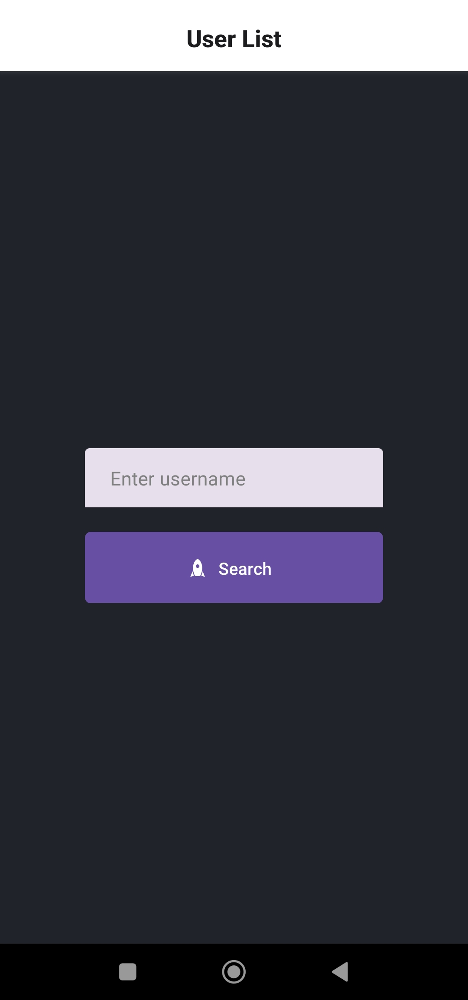
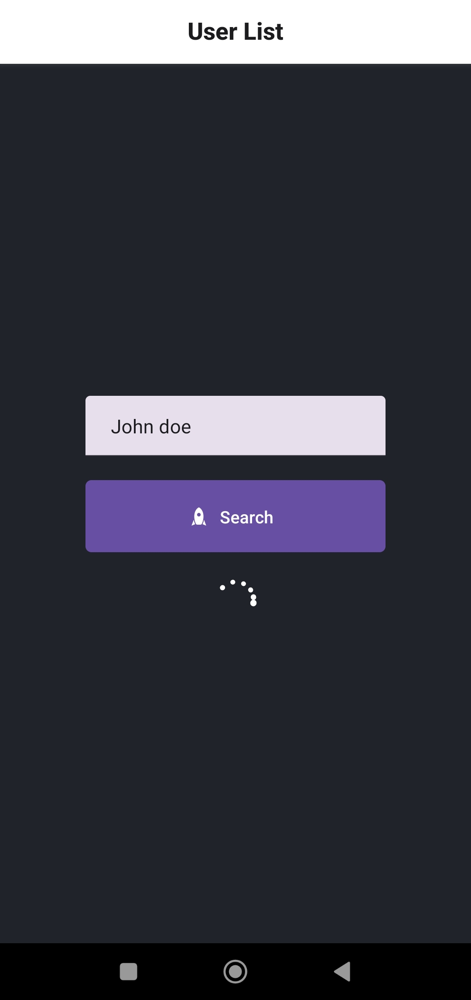
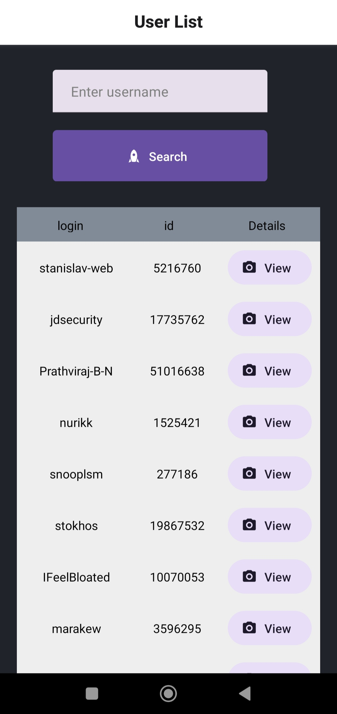

# User List APP React Native 0.72 And Expo

<div>


</div>
<div>


</div>

Mobile App that obtain a list of users and show the information from your profiles, exploiting the Github Public API.

API endpoint here: [https://tickets-api-production.up.railway.app/api/tickets](https://tickets-api-production.up.railway.app/api/tickets)

---

## Features

In this project, it demonstrates the ability to:

- Develop in React Native.
- Consumption of an API rest.
- Configuration of a mobile development environment with Expo.
- Create a development and production build APK.
- Unitary Test Implementation.

---

## 🚀 Build Setup

### Prerequisites:

- **Node version 14.x**

If you want to run the site locally, you can:

1. Clone the project.

```bash
https://github.com/Johndev85/users-list-react-native.git
```

2. Go to project's folder

```bash
cd users-list-react-native
```

3. Install dependencies:

```bash
npm i
```

4. Open server:

```bash
npm run web
```

---

## Technologies

- Javascript
- React Native
- Expo
- Expo build deploy
- Jest

---

## Contribute

If you want to contribute with this project, just make a Pull Request explaining the improving ✨.

---

## License

The MIT License (MIT)

---
